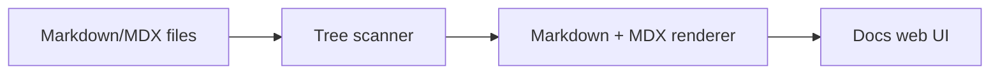

# Introduction

Welcome to the docs preview workspace.

This mini documentation set is intentionally a bit larger so layout, navigation depth, typography rhythm, and table/code rendering can be judged more realistically.

## What this docs set contains

- **Guides** for practical setup steps
- **Concepts** for architecture and mental model
- **Tutorials** for end-to-end walkthroughs
- **Reference** for API and configuration details

## Quick architecture sketch

## Reading path

1. Start with **Guides / Getting Started**
2. Continue with **Concepts / Information Architecture**
3. Use **Reference** while implementing
